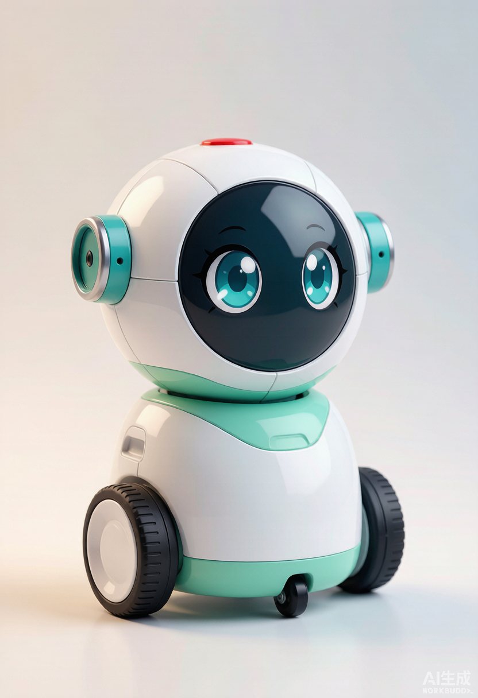

# 桌面机器人 · 萌系可移动桌宠 🤖

> **会走、会摇头点头、会语音对话、能帮你操作电脑的桌面机器人**
> 架构：ESP32-S3（感官终端） + 电脑 Python Agent Hub（大脑） + MiniMax 云（算力）



## 功能特性

| 能力 | 说明 | 状态 |
|------|------|:---:|
| 免按键语音对话 | VAD 自动检测，说话即聊、静音即停 | 🚧 Phase 2 |
| 语音控制电脑 | 打开应用 / 发消息 / 执行命令（白名单） | 🚧 Phase 3 |
| 敲桌即走 | 双麦 TDOA 声音定位 + 底盘移动 | 🚧 Phase 4 |
| 摇头点头拟人 | 双舵机软限位动作 + 大眼睛表情屏 | 🚧 Phase 1/5 |
| 深睡待机 | Deep Sleep + 声音唤醒（<5mA） | 🚧 Phase 5 |
| WiFi 可升级 | 主控自带 WiFi，串口/无线同协议 | 预留 |

## 系统架构

```
你 ──语音──► 桌面机器人(ESP32-S3) ──USB串口──► 电脑 Agent Hub(Python) ──HTTPS──► MiniMax 云
             │ 麦克风/喇叭/屏幕/舵机/电机       │ ASR/M3/TTS 客户端、工具层           │ ASR+M3+Speech
             └──── 感官终端 ────┘              └────── 大脑 ──────┘                └── Token Plan ──┘
```

- **机器人**：只做收发——录音、播音、表情显示、头部动作、底盘移动、敲击定位、防跌落
- **电脑 Hub**：串口桥、MiniMax 客户端、Agent 核心（工具调用）、应用/命令白名单
- **MiniMax**：一个订阅 Key 覆盖对话（M3）+ 语音合成（Speech 2.8），中文对话成本近零

## 📦 Phase 0 已可用（无需硬件）

电脑端 ↔ MiniMax 云端链路已全部打通并验证：

| 能力 | 实现 | 验证结果 |
|------|------|:---:|
| M3 对话 | OpenAI 兼容 `chat/completions` | ✅ |
| TTS 语音合成 | 原生端点 `/v1/t2a_v2`（hex 解码） | ✅ |
| ASR 语音转写 | **本地 faster-whisper**（Token Plan 无云端 ASR） | ✅ |

### 快速开始

```bash
# 1. 环境（Python 3.10+）
cd hub
python -m venv .venv
.venv/Scripts/pip install -r requirements.txt

# 2. 配置 API Key（二选一）
#    A. 编辑项目根目录 config.yaml → minimax.api_key
#    B. 环境变量：set MINIMAX_API_KEY=sk-xxx

# 3. 联通测试（三接口全 ✅ 即通过；--asr 走本地转写）
.venv/Scripts/python test_minimax.py --asr test_tts.wav

# 4. 文本语音对话（"小萌"陪你聊，自动 TTS 出声）
.venv/Scripts/python main.py
```

### 本地 ASR（语音转写）

MiniMax Token Plan 未提供 ASR 接口（实测 `/v1/asr`、`/audio/transcriptions` 均 404），语音转写改用**本地 faster-whisper**：

- 封装：`hub/asr.py` → `local_transcribe(wav_bytes)`（懒加载单例 + vad 过滤）
- 模型：`hub/models/faster-whisper-small/`（483MB，small 中文够用）
- 加速：RTX 显卡装 `ctranslate2[cuda12]` 后 `device="cuda"` 切换

## 配置体系（敏感信息不入库）

```
config.yaml          # 全局配置：API Key / 模型名 / 串口 / 白名单（.gitignore 排除）
hub/config.example.yaml  # 模板（提交）
hub/settings.py      # 加载器：环境变量 > config.yaml > 内置默认值
```

API Key 两种填法：`config.yaml` 的 `minimax.api_key`，或环境变量 `MINIMAX_API_KEY`（代码优先读环境变量）。

## 目录结构

```
├── config.yaml              # 全局配置（不入库）
├── hub/                     # 电脑端 Agent Hub（Python）
│   ├── main.py              # 文本语音对话入口（Phase 0 ✅）
│   ├── minimax_client.py    # M3 / TTS / ASR 封装（✅）
│   ├── asr.py               # 本地 faster-whisper 转写（✅）
│   ├── settings.py          # 配置加载器（✅）
│   ├── test_minimax.py      # 联通测试（✅）
│   ├── requirements.txt
│   └── models/              # 本地 ASR 模型（不入库）
├── firmware/                # ESP32 固件（Arduino，C 风格）
│   └── config.h             # 引脚映射（已定稿）
├── docs/
│   ├── protocol.md          # 通信协议规范
│   └── development-plan.md  # 开发计划
├── generated-images/        # 外观概念图
└── 桌面机器人项目方案书.md    # 项目方案（硬件/预算/路线）
```

## 硬件 BOM

| 模块 | 选型 | 预算 |
|------|------|:---:|
| 主控 | ESP32-S3-DevKitC-1 **N16R8**（16M Flash + 8M PSRAM） | ¥35 |
| 语音 | INMP441 ×2 + MAX98357A + 40mm 喇叭 | ¥39 |
| 显示 | 1.3寸 ST7789 IPS 240×240 | ¥18 |
| 头部 | MG90S ×2 + 双轴云台（摇头 ±90° / 点头 ±30°） | ¥28 |
| 移动 | TT 马达带编码器 ×2 + TB6612 + 万向轮 | ¥40 |
| 安全 | TCRT5000 ×2 防跌落 + LM393 声音唤醒 | ¥9 |
| 电源 | 18650 带保护 + 充放电一体板（Type-C + 5V 升压） | ¥25 |
| 结构 | 3D 打印外壳（白 + 薄荷绿 PLA） | ¥52 |

> 完整清单（含搜索关键词）：`robot-shopping-list.html`（交互勾选版）。必购约 ¥302。

## 通信协议（串口 · JSON 行 · 921600）

上行：`hello` / `audio` / `vad` / `knock` / `telemetry`
下行：`play` / `face` / `text` / `servo` / `move` / `locate` / `mode` / `reboot`

详见 [`docs/protocol.md`](docs/protocol.md)

## 开发路线

| 阶段 | 内容 | 状态 |
|------|------|:---:|
| **Phase 0** | 电脑端先行：MiniMax 联通（对话 + TTS + 本地 ASR） | ✅ 完成 |
| Phase 1 | 工程骨架 + 串口 + 屏幕点亮 | 待板子 |
| Phase 2 | 语音闭环：录音 → ASR → M3 → TTS → 播放 | 待板子 |
| Phase 3 | Agent 工具：语音控制电脑（白名单 + 安全确认） | 可并行 |
| Phase 4 | 移动 + 敲击定位 | 待板子 |
| Phase 5 | 深睡待机 + 表情动画 + 定时提醒 + 外壳 | 待板子 |

## 安全原则

- API Key 一律走 `config.yaml` / 环境变量，**不硬编码、不入库**（`.gitignore` 已排除）
- 工具执行全部**白名单化**，危险操作前 TTS 询问用户确认
- 电机/舵机动作全部**软限位**，防跌落为最高优先级中断

## 相关文档

- 📋 [项目方案书](桌面机器人项目方案书.md)（硬件 / 预算 / 风险）
- 📡 [通信协议规范](docs/protocol.md)
- 🗺️ [开发计划](docs/development-plan.md)
